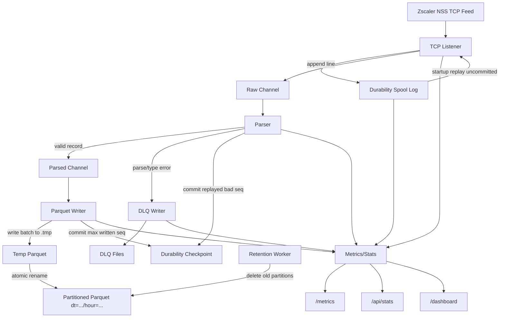

# nss-ingestor

`nss-ingestor` is a Rust service that ingests Zscaler NSS web logs over TCP and writes partitioned Parquet files for fast local analytics (DuckDB-first).

## License and Commercial Use

This project is source-available under `BUSL-1.1` (Business Source License), not OSI open source.

- License terms: `LICENSE`
- Commercial subscription terms: `COMMERCIAL_LICENSE.md`

Production/commercial use requires a paid monthly commercial subscription from the Licensor.

Note: copies or versions that were already distributed under the prior MIT license remain available under MIT for those copies/versions.

## What It Does

- Listens for newline-delimited NSS records on TCP (default `0.0.0.0:514`)
- Parses CSV-style records using an enforced built-in schema profile (recommended: `zscaler_web_v2_ops`)
- Optionally enforces strict type validation per schema field
- Converts rows into typed Arrow columns and writes Parquet with ZSTD compression
- Partitions output as `dt=YYYY-MM-DD/hour=HH` for efficient time-range queries
- Uses atomic Parquet finalize (`.tmp` -> rename) to avoid exposing partial files
- Writes malformed records to a dead-letter queue (DLQ)
- Exposes Prometheus metrics plus built-in stats API/dashboard
- Supports durability spool + replay with checkpointed commit (at-least-once)
- Cleans up old partitions using retention policy (default 14 days)

## Architecture

Pipeline:
1. `TCP Listener` receives lines from NSS feed.
   Before enqueue, records can be appended to local durability spool.
2. `Parser` validates field count and extracts event time.
   If strict type validation is enabled, invalid typed fields go to DLQ.
3. `Writer` batches rows and writes Parquet by day/hour partition.
   After successful write, durability checkpoint is committed.
4. `DLQ` stores malformed/unparseable lines.
5. `Retention` periodically deletes old local partitions.

### Flowchart



## Prerequisites

- Rust toolchain (tested with `rustc 1.94.1`)
- Network access from NSS sender to this host on TCP port `514` (or custom port)
- Sufficient disk for Parquet + DLQ

For non-root processes binding to port `<1024` on Linux:

```bash
sudo setcap 'cap_net_bind_service=+ep' ./target/release/nss-ingestor
```

Or run on a high port (example `5514`) and use network forwarding.

## Configuration

Use [config.example.toml](./config.example.toml) and one of:
- [schema.example.yaml](./schema.example.yaml) (`zscaler_web_v1` compatibility sample)
- [schema.zscaler_web_v2_ops.yaml](./schema.zscaler_web_v2_ops.yaml) (ops-focused sample)

### How configuration is applied

- Config is loaded at process start.
- There is no hot-reload today. After changing `config.toml` or `schema.yaml`, restart the service.
- Relative paths are resolved relative to the config file location.

### `config.toml` deep dive

#### `[listener]`

Ingress TCP behavior and backpressure entrypoint.

- `bind_addr`: Listener address/port (example `0.0.0.0:514` or `127.0.0.1:5514`)
- `max_line_bytes`: Drops oversized lines to DLQ with parse error metric
- `read_timeout_secs`: Idle connection timeout; stale senders are disconnected
- `max_connections`: Hard cap of concurrent TCP connections; new ones are dropped beyond this
- `ingress_channel_capacity`: Buffer from listener -> parser
- `parsed_channel_capacity`: Buffer from parser -> parquet writer

Tuning guidance:
- Increase channel capacities if short bursts are dropped.
- Increase `max_connections` only if sender fan-in is high and host resources allow it.
- Keep `read_timeout_secs` low enough to clean dead sockets.

#### `[schema]`

Schema contract behavior.

- `profile`: Built-in profile ID (`zscaler_web_v2_ops` or `zscaler_web_v1`)
- `custom_schema_mode`: `false` by default; when `false`, the built-in profile is enforced
- `path`: Schema YAML path (used only when `custom_schema_mode = true`)
- `time_field` / `time_format` / `timezone`: When `custom_schema_mode = false`, these are enforced from the selected profile at runtime
- `strict_type_validation`: If `true`, invalid typed values go to DLQ

Validation behavior:
- `nullable: false` fields are always enforced and rejected to DLQ when empty/`None`/`N/A`.
- Type validation is additionally enforced when `strict_type_validation = true`.

Operational note:
- In canonical mode (`custom_schema_mode = false`), keep NSS feed output exactly aligned with the published profile template.

Built-in profile guidance:
- `zscaler_web_v2_ops`: optimized for blocked-traffic analysis, connection/network troubleshooting, SSL/TLS diagnostics, and geo reporting.
- `zscaler_web_v1`: legacy compatibility profile.

If you use `nss-quarry` with `zscaler_web_v2_ops`, update quarry field mappings from legacy encoded names to plain names:
- `user_field = "login"` (instead of `ologin`)
- `url_field = "url"` (instead of `eurl`)
- `helpdesk_mask_fields` should include `login` (instead of `ologin`)

#### `[writer]`

Parquet write shape and throughput/latency behavior.

- `output_dir`: Root parquet directory
- `batch_rows`: Rows per in-memory batch before write
- `flush_interval_secs`: Time-based flush interval
- `target_file_rows`: Rotate parquet file around this row count
- `compression`: `zstd` (recommended) or other supported codec

Startup behavior:
- Orphan `.parquet.tmp` files from prior unclean shutdowns are removed at startup.

Tuning guidance:
- Higher `batch_rows` improves throughput but increases memory and flush latency.
- Higher `target_file_rows` reduces file count but increases single-file size.

#### `[dlq]`

Dead-letter handling for malformed or invalid records.

- `path`: DLQ output directory
- `channel_capacity`: Buffer for DLQ writer
- `local_days`: Keep DLQ log files for this many days
- `sweep_interval_secs`: DLQ retention scan interval

#### `[retention]`

Automatic local parquet cleanup.

- `enabled`: Enable local retention sweeps
- `local_days`: Keep this many days of partitions
- `sweep_interval_secs`: Retention scan interval

#### `[metrics]`

Observability API and health thresholds.

- `enabled`: Expose HTTP metrics/stats endpoints
- `bind_addr`: Metrics server address
- `dashboard_enabled`: Enable `/dashboard` UI
- `stats_window_hours`: Trend horizon window (used for dashboard/API trends and persisted state window)
- `degraded_error_ratio` / `critical_error_ratio`: Error ratio thresholds
- `degraded_stale_seconds` / `critical_stale_seconds`: Ingest staleness thresholds

Defaults:
- App default for `dashboard_enabled` is `false`.
- Installer-generated config sets `dashboard_enabled = true`.
- Dashboard/stat trend state is persisted to `writer.output_dir/.metrics-state.json` and restored on restart.

#### `[durability]`

Crash/restart safety for at-least-once ingestion.

- `enabled`: Enable local spool + replay
- `path`: Durability spool directory
- `fsync_every`: Lower is safer (more fsync), higher is faster
- `max_log_bytes`: Triggers compaction when spool grows large

Semantics:
- Enabled: at-least-once delivery.
- Disabled: best-effort delivery.

### `schema.yaml` requirements

These requirements apply when `custom_schema_mode = true`.

- Field order must exactly match NSS feed output order.
- Each field must declare:
  - `name`
  - `type` (`string`, `int64`, `float64`, `boolean`, `timestamp`, `ip`)
  - optional `nullable` (default `true`)
- The configured `time_field` must exist in schema and be parseable with `time_format` and `timezone`.

### Changing config on a running service

Safe production workflow (`systemd` deployment):

```bash
sudo cp /etc/nss-ingestor/config.toml /etc/nss-ingestor/config.toml.bak.$(date +%Y%m%d%H%M%S)
sudoedit /etc/nss-ingestor/config.toml
sudo -u nssingestor /usr/local/bin/nss-ingestor validate-config --config /etc/nss-ingestor/config.toml
sudo systemctl restart nss-ingestor
sudo systemctl status nss-ingestor --no-pager
curl -s http://127.0.0.1:9090/api/stats
```

If restart fails:

```bash
sudo cp /etc/nss-ingestor/config.toml.bak.<timestamp> /etc/nss-ingestor/config.toml
sudo systemctl restart nss-ingestor
```

When changing schema:
- Validate before restart.
- Prefer writing new data to a new output path or date boundary to avoid mixing parquet schemas in one query path.

## Build and Run

Build:

```bash
cargo build --release
```

Run:

```bash
./target/release/nss-ingestor run --config ./config.toml
```

## Direct Parquet Backfill (No TCP Pipeline)

Use this mode when you only need realistic Parquet data quickly (for example to test `nss-quarry`) and do not need to exercise the live TCP ingest path.

It bypasses:
- TCP listener
- parser loop
- durability spool

It still uses the production Parquet writer and partition layout.

Example:

```bash
./target/release/nss-ingestor backfill-direct \
  --config /etc/nss-ingestor/config.toml \
  --total-rows 100000000 \
  --days 13 \
  --workers 32 \
  --seed 20260404 \
  --progress-every 1000000
```

Arguments:
- `--config`: normal ingestor config file (writer/schema settings are reused)
- `--total-rows`: total synthetic rows to generate
- `--days`: spread event timestamps across the last N days
- `--workers`: parallel generators feeding the writer channel
- `--seed`: deterministic seed for repeatable data
- `--progress-every`: log progress every N generated rows

## Get the Project

```bash
git clone https://github.com/EggertsIT/nss-to-parquet.git
cd nss-to-parquet
```

## Quick Install (One Line)

For `RHEL 9` / `Rocky 9` hosts:

```bash
git clone https://github.com/EggertsIT/nss-to-parquet.git && cd nss-to-parquet && ./install.sh --install-deps --install-rust
```

This builds the binary, installs config/schema/systemd service, validates config, and starts `nss-ingestor`.
Run it as a privileged non-root user (with `sudo` access), not from a root login shell.
Installer enforces the selected built-in schema profile and prints the exact NSS Feed Output template to configure.
Installer prints this template between `BEGIN/END NSS FEED OUTPUT` markers and stores it as:
- `/etc/nss-ingestor/feed-template.zscaler_web_v2_ops.txt` (default)
- `/etc/nss-ingestor/feed-template.zscaler_web_v1.txt` (if legacy profile selected)
Default installer profile is `zscaler_web_v2_ops`. Use `--schema-profile zscaler_web_v1` for legacy compatibility.

## AWS Terraform Sample

An AWS deployment sample is available in [infra/aws](./infra/aws).
It provisions a single EC2-based ingestor with security group allowlisting, SSM access profile, and enforced private-subnet deployment (no public ingest IP).

Quick start:

```bash
cd infra/aws
cp terraform.tfvars.example terraform.tfvars
terraform init
terraform plan
terraform apply
```

## RHEL 9 / Rocky 9 Installation and Setup

This section is a production-style setup for `RHEL 9` and `Rocky Linux 9`.

If Rust is already present and OS dependencies are already installed, you can use:

```bash
./install.sh
```

If you run from a root account and pass `--install-rust`, the installer will stop by default to avoid installing Rust under `/root`.

Installer options:

```text
./install.sh --help
```

Useful schema-profile command:

```bash
# Print enforced NSS feed template for the default profile
./target/release/nss-ingestor print-schema-profile --profile zscaler_web_v2_ops --feed-template-only
```

### 1. Install OS dependencies

```bash
sudo dnf -y install \
  git curl gcc gcc-c++ make cmake pkgconfig \
  openssl-devel clang llvm \
  policycoreutils-python-utils
```

### 2. Install Rust toolchain

```bash
curl https://sh.rustup.rs -sSf | sh -s -- -y
source "$HOME/.cargo/env"
rustc --version
cargo --version
```

### 3. Build the binary

From your project checkout:

```bash
cargo build --release
```

Install binary:

```bash
sudo install -m 0755 target/release/nss-ingestor /usr/local/bin/nss-ingestor
```

### 4. Create service user and directories

```bash
sudo useradd --system --create-home --home-dir /var/lib/nss-ingestor --shell /sbin/nologin nssingestor

sudo install -d -m 0750 -o root -g nssingestor /etc/nss-ingestor
sudo install -d -m 0750 -o nssingestor -g nssingestor /var/lib/nss-ingestor/data
sudo install -d -m 0750 -o nssingestor -g nssingestor /var/lib/nss-ingestor/dlq
sudo install -d -m 0750 -o nssingestor -g nssingestor /var/lib/nss-ingestor/spool
```

### 5. Install config and schema

```bash
sudo install -m 0640 -o root -g nssingestor config.example.toml /etc/nss-ingestor/config.toml
sudo install -m 0640 -o root -g nssingestor schema.zscaler_web_v2_ops.yaml /etc/nss-ingestor/schema.yaml
```

For legacy profile `zscaler_web_v1`, install `schema.example.yaml` instead.

Edit `/etc/nss-ingestor/config.toml` and set production paths:

```toml
[schema]
profile = "zscaler_web_v2_ops"
custom_schema_mode = false
path = "/etc/nss-ingestor/schema.yaml"

[writer]
output_dir = "/var/lib/nss-ingestor/data"

[dlq]
path = "/var/lib/nss-ingestor/dlq"
local_days = 14
sweep_interval_secs = 3600

[durability]
enabled = true
path = "/var/lib/nss-ingestor/spool"
fsync_every = 100
max_log_bytes = 536870912

[listener]
bind_addr = "0.0.0.0:514"
max_connections = 1024
read_timeout_secs = 30
```

### 6. Validate config before starting service

```bash
sudo -u nssingestor /usr/local/bin/nss-ingestor validate-config --config /etc/nss-ingestor/config.toml
```

### 7. Create systemd service

Create `/etc/systemd/system/nss-ingestor.service`:

```ini
[Unit]
Description=NSS Ingestor (TCP -> Parquet)
After=network-online.target
Wants=network-online.target

[Service]
Type=simple
User=nssingestor
Group=nssingestor
WorkingDirectory=/var/lib/nss-ingestor
ExecStart=/usr/local/bin/nss-ingestor run --config /etc/nss-ingestor/config.toml
Restart=always
RestartSec=5
LimitNOFILE=262144
NoNewPrivileges=true
AmbientCapabilities=CAP_NET_BIND_SERVICE
CapabilityBoundingSet=CAP_NET_BIND_SERVICE
PrivateTmp=true
ProtectSystem=full
ProtectHome=true
ProtectKernelTunables=true
ProtectKernelModules=true
ProtectControlGroups=true
ReadWritePaths=/var/lib/nss-ingestor
ReadOnlyPaths=/etc/nss-ingestor

[Install]
WantedBy=multi-user.target
```

Enable and start:

```bash
sudo systemctl daemon-reload
sudo systemctl enable --now nss-ingestor
sudo systemctl status nss-ingestor --no-pager
```

### 8. Configure firewall (if needed)

Allow NSS ingest port:

```bash
sudo firewall-cmd --permanent --add-port=514/tcp
sudo firewall-cmd --reload
```

If metrics/dashboard should be remotely reachable, also allow `9090/tcp`:

```bash
sudo firewall-cmd --permanent --add-port=9090/tcp
sudo firewall-cmd --reload
```

### 9. SELinux notes (Enforcing mode)

In most deployments, the service runs correctly with the unit above.
If SELinux blocks access, check denials first:

```bash
sudo ausearch -m AVC,USER_AVC -ts recent | audit2why
```

Then apply a targeted local policy only if required:

```bash
sudo ausearch -m AVC,USER_AVC -ts recent | audit2allow -M nss_ingestor_local
sudo semodule -i nss_ingestor_local.pp
```

### 10. Verify runtime health

```bash
sudo journalctl -u nss-ingestor -f
ss -ltn | grep ':514'
curl -s http://127.0.0.1:9090/metrics | head
curl -s http://127.0.0.1:9090/api/stats
```

Open dashboard on the server (desktop session only):

```bash
xdg-open http://127.0.0.1:9090/dashboard
```

Access dashboard from your laptop (recommended for headless servers):

```bash
ssh -L 9090:127.0.0.1:9090 admin@<server-host-or-ip>
```

Then open in your local browser:

```text
http://127.0.0.1:9090/dashboard
```

### 11. Point Zscaler NSS feed

Configure your NSS feed destination to this host IP on `TCP 514` (or your custom `listener.bind_addr` port).
Use the exact canonical feed template:

```bash
/usr/local/bin/nss-ingestor print-schema-profile --profile zscaler_web_v2_ops --feed-template-only
```

For legacy profile:

```bash
/usr/local/bin/nss-ingestor print-schema-profile --profile zscaler_web_v1 --feed-template-only
```

## Validation Commands

Validate config + schema linkage:

```bash
cargo run -- validate-config --config ./config.example.toml
```

Validate schema and sample lines:

```bash
cargo run -- validate-schema --schema ./schema.example.yaml --sample ./sample.log
```

Generate schema from NSS feed template string:

```bash
cargo run -- generate-schema \
  --feed-template '"%s{time}","%s{ologin}","%s{proto}","%s{eurl}"' \
  --output ./schema.generated.yaml
```

Generate schema from a template file:

```bash
cargo run -- generate-schema \
  --feed-template-file ./nss_feed_template.csv \
  --output ./schema.generated.yaml
```

If output file already exists, add `--force`.
Use generated schema only with `custom_schema_mode = true`.

Benchmark sustained ingest rate:

```bash
python3 ./scripts/benchmark_ingest.py \
  --host 127.0.0.1 \
  --port 514 \
  --stats-url http://127.0.0.1:9090/api/stats \
  --line-file ./sample.log \
  --duration-secs 120 \
  --connections 16
```

Targeted-rate benchmark (example 600k logs/min target):

```bash
python3 ./scripts/benchmark_ingest.py \
  --host 127.0.0.1 \
  --port 514 \
  --stats-url http://127.0.0.1:9090/api/stats \
  --line-file ./sample.log \
  --duration-secs 180 \
  --connections 16 \
  --target-lpm 600000
```

The script prints `estimated_safe_sustained_logs_per_min` derived from measured ingest/write deltas.

## Output Layout

Parquet files are written under `writer.output_dir`:

```text
data/
  dt=2026-04-03/
    hour=15/
      part-000000.parquet
      part-000001.parquet
```

DLQ files are written daily:

```text
dlq/
  dlq-2026-04-03.log
```

DLQ retention is controlled by `[dlq].local_days` and `[dlq].sweep_interval_secs`.

DLQ line format:

```text
<received_at_rfc3339>\t<peer_addr>\t<reason>\t<raw_line>
```

Metrics persistence file:

```text
data/.metrics-state.json
```

## Metrics

If enabled, scrape:

```text
GET /metrics
```

Liveness probe:

```text
GET /healthz
```

Readiness probe (`200` when ready, `503` when critical health):

```text
GET /readyz
```

Structured stats API:

```text
GET /api/stats
```

Schema overview API (active schema loaded by service):

```text
GET /api/schema
```

`/api/schema` includes profile/mode metadata (`schema_profile`, `custom_schema_mode`) and, in profile mode, the expected NSS feed template.

Config overview API (active resolved config loaded by service):

```text
GET /api/config
```

Built-in dashboard (if `metrics.dashboard_enabled = true`):

```text
GET /dashboard
```

Exposed counters:

- `nss_ingestor_raw_received_total`
- `nss_ingestor_parsed_ok_total`
- `nss_ingestor_parsed_error_total`
- `nss_ingestor_written_rows_total`
- `nss_ingestor_written_files_total`
- `nss_ingestor_dlq_rows_total`
- `nss_ingestor_durability_replayed_total`
- `nss_ingestor_durability_commits_total`
- `nss_ingestor_durability_errors_total`
- `nss_ingestor_connection_dropped_total`
- `nss_ingestor_connection_timeouts_total`

`/api/stats` includes:

- totals (ingested, parsed ok/error, written rows/files, DLQ)
- rates (`1m` and `5m` per second for ingest/write/errors/DLQ)
- freshness (seconds since last ingest/write activity)
- health status (`ok`, `degraded`, `critical`) and reasons
- 24h trend persistence across service restarts
- dashboard trend graphs for both past 24h and past 1h
- restart metadata (`count_24h`, `last_restart_at`, restart `events`)
- `/dashboard` includes a schema overview table sourced from `/api/schema`
- `/dashboard` includes active config visibility sourced from `/api/config`
- `/dashboard` marks service restarts in the current 24h window

## Dependency Audit Policy

- CI runs `cargo audit` with `--deny warnings`.
- Temporary exceptions are tracked in [`audit-allowlist.txt`](./audit-allowlist.txt).
- Update allowlist entries only with explicit risk acceptance and periodic review.
- Local command:

```bash
./scripts/run_audit.sh
```

## Release Artifacts (SBOM + Signed Checksums)

On tag pushes matching `v*`, GitHub Actions workflow [`release-artifacts.yml`](./.github/workflows/release-artifacts.yml) publishes:

- `nss-ingestor-linux-x86_64`
- `checksums.txt` (SHA-256)
- `checksums.txt.sig` + `checksums.txt.pem` (cosign keyless signature + certificate)
- `sbom.cdx.json` (CycloneDX SBOM via Syft)

Verify downloaded binary hash:

```bash
sha256sum -c checksums.txt
```

Verify signed checksums:

```bash
cosign verify-blob \
  --certificate checksums.txt.pem \
  --signature checksums.txt.sig \
  --certificate-oidc-issuer https://token.actions.githubusercontent.com \
  --certificate-identity-regexp "https://github.com/.+/.+/.github/workflows/release-artifacts.yml@refs/tags/.+" \
  checksums.txt
```

## DuckDB Query Examples

Top actions by hour:

```sql
SELECT
  date_trunc('hour', "time") AS hour_bucket,
  action,
  count(*) AS events
FROM read_parquet('data/dt=*/hour=*/*.parquet')
GROUP BY 1, 2
ORDER BY hour_bucket DESC, events DESC
LIMIT 100;
```

Top blocked domains:

```sql
SELECT
  host,
  count(*) AS blocked_events
FROM read_parquet('data/dt=*/hour=*/*.parquet')
WHERE action = 'Blocked'
GROUP BY host
ORDER BY blocked_events DESC
LIMIT 50;
```

## Operations Notes

- With `[durability].enabled = true`, delivery semantics are **at-least-once**.
- If durability is disabled, semantics are **best-effort**.
- Critical worker failures (listener/parser/writer/dlq/metrics) cause process exit so `systemd` restart can recover.
- Keep NSS feed output aligned to your enforced profile (`zscaler_web_v2_ops` or `zscaler_web_v1`) unless you explicitly run in `custom_schema_mode`.
- Tune `batch_rows` and `target_file_rows` to balance write throughput vs file size.
- Keep retention enabled to avoid unbounded local disk growth.
- Keep DLQ retention enabled (`[dlq].local_days > 0`) to avoid unbounded DLQ growth.
- Service handles `SIGTERM` (for `systemctl restart/stop`) and performs graceful writer shutdown/finalize.

## Troubleshooting

- `Operation not permitted` on startup:
  - Port permission issue (common on `:514`) or sandbox/network policy.
- High parser errors:
  - NSS feed output does not match the configured enforced profile
  - Different delimiter/quoting behavior than expected
  - In custom mode, incorrect `time_field`/`time_format`/`timezone`
- No Parquet files:
  - Check listener bind, ingress traffic, parser metrics, and DLQ contents.
- High `nss_ingestor_connection_dropped_total`:
  - Increase `listener.max_connections` or scale out multiple ingestors.
- High `nss_ingestor_durability_errors_total`:
  - Check spool filesystem health/permissions and available disk.
